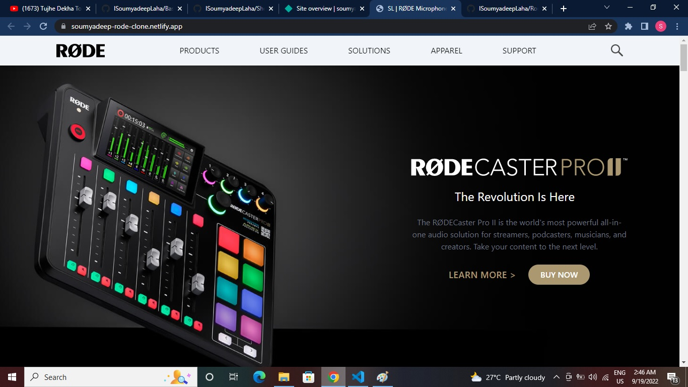

# RODE Clone using (HTML + TailwindCSS)

By Soumyadeep Laha

# Key learnings

- learned how to use different utility classes by using TailwindCSS
- learned how to use hidden utility of Tailwinf to use different images in responsive view.

# Time to complete

It tooked me around 12 to 13 hrs of hard code.

# Screen Sort

# Live Link

[Netlify Link...](https://soumyadeep-rode-clone.netlify.app/)